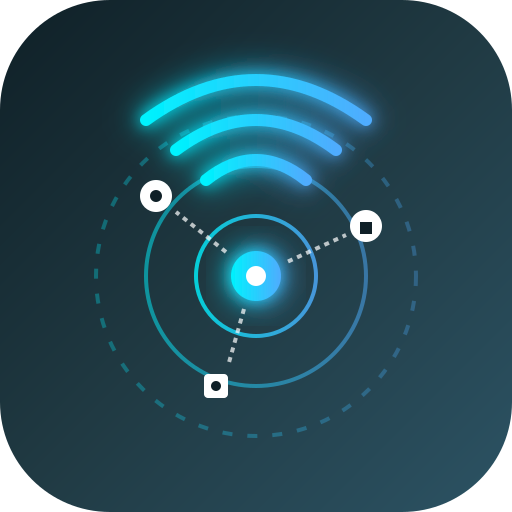

<div align="center">



# MyZone

**Détection et classification des objets connectés sur le réseau local**

[](https://en.cppreference.com/w/cpp/17)
[](http://www.codeblocks.org/)
[](#)
[](#)
[](#)
[](#)

</div>

---

Outil en C++ pour détecter les objets connectés présents sur le réseau local et les classer automatiquement par catégorie : **modem/routeur**, **wifi/réseau**, **objets IoT**.

## Objectif

MyZone scanne la zone réseau locale, identifie les appareils actifs via leur adresse MAC, et détermine leur fabricant et leur type grâce à une base de données OUI (*Organizationally Unique Identifier*). Chaque appareil détecté est ensuite classé dans une des catégories cibles pour donner une vue claire de ce qui est connecté sur le réseau.

## Fonctionnement (Phase 1 - lookup)

1. Récupération des adresses MAC actives sur le réseau local
2. Extraction de l'OUI (les 3 premiers octets de l'adresse MAC = identifiant fabricant)
3. Lookup dans la base OUI pour retrouver le fabricant et le type d'appareil
4. Classification en catégories (Modem, Wifi/Réseau, IoT, ou Inconnu si aucune correspondance)

## Structure du projet

```
MyZone/
├── MyZone.cbp                 # Fichier projet Code::Blocks
├── data/
│   └── oui_lookup.csv         # Base de données OUI (fabricant + type d'appareil)
├── include/
│   ├── MacAddress.hpp         # Parsing et normalisation d'adresses MAC
│   ├── OuiDatabase.hpp        # Chargement CSV et lookup OUI
│   └── DeviceCategory.hpp     # Classification par catégorie
├── src/
│   ├── main.cpp
│   ├── MacAddress.cpp
│   ├── OuiDatabase.cpp
│   └── DeviceCategory.cpp
├── build/                     # Fichiers objets générés (ignoré par git)
├── bin/                       # Exécutable généré (ignoré par git)
└── .gitignore
```

## Prérequis

- Compilateur C++17 (GCC/MinGW recommandé)
- [Code::Blocks](http://www.codeblocks.org/) (IDE utilisé pour ce projet)

## Compilation

1. Ouvrir `MyZone.cbp` dans Code::Blocks
2. Build → Build (`Ctrl+F9`)
3. L'exécutable est généré dans `bin/Debug/` (ou `bin/Release/`)

## Base de données 

Le fichier `data/lookup.csv` contient les correspondances OUI → fabricant → type d'appareil, avec les colonnes suivantes :

| Colonne | Description |
|---|---|
| `oui` | Préfixe MAC (3 premiers octets) |
| `manufacturer` | Nom du fabricant |
| `registry` | Type de registre IEEE (MA-L, MA-M, MA-S...) |
| `short_name` | Nom court du fabricant |
| `device_type` | Type d'appareil (Router, IoT, SmartHome, Camera...) |
| `registered_date` | Date d'enregistrement IEEE |
| `address` | Adresse du fabricant |
| `sources` | Sources ayant contribué à l'entrée |

## Roadmap

- [x] Structure de base du projet
- [ ] Implémentation du parsing MAC (`MacAddress`)
- [ ] Implémentation du chargement CSV et du lookup (`OuiDatabase`)
- [ ] Implémentation de la classification (`DeviceCategory`)
- [ ] Scan réseau local (récupération des adresses MAC actives — ARP/ping sweep)
- [ ] Classification avancée (scan de ports, fingerprinting)
- [ ] Interface CLI avancée
- [ ] Interface graphique (UI)

## Auteur

**Félix Tovignan** - [Dark Packet](https://github.com/)